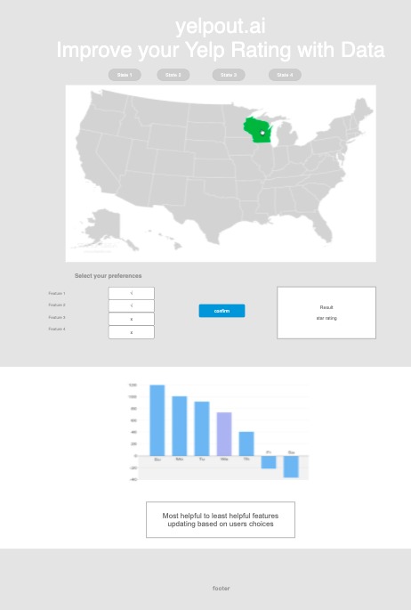
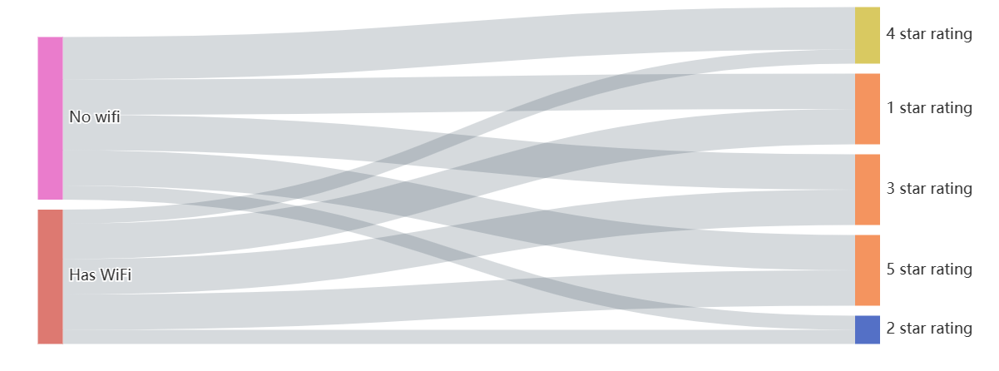

<!---

---
title: "CASA0017: Web Architecture Final Assessment"
author: "Abhipsa Kar, August Weinbren, Dongyi Ma, Zixu Cheng"
date: "18 Nov 2021"
---

-->

# <h2>YELPOUT.AI</h2>

Abhipsa Kar, August Weinbren, Zixu Cheng, Dongyi Ma

GITHUB REPO PATH :   <https://github.com/casa-ucl/casa0017-assessment--yelpout/tree/main/Website>

## Project Context
The modern-day consumer is spoilt with choices when it comes to products and services. In response, there has been a surge in the number of tools available at the consumer’s disposal to help them choose their purchases. These tools are often based on crowd-sourced data and considered reliable by consumers. 

One of these such tools is Yelp, which is primarily used for restaurant reviews. Survey data shows that the number of reviews submitted to Yelp has been increasing sharply since 2008. The latest number in 2020 stands at 224 million globally. The number of unique mobile users on Yelp in 2020 stood at around 283 million (Yelp: Cumulative Number of Reviews, 2020). 

 However, the potential usage of this data has been left untapped by sellers. We believe that leveraging modern data analysis techniques to leverage this data can help restaurant owners to improve their businesses among stiff competition and low profit margins. Specifically, these analytical methods could be used to identify market trends and analyze the sources of a highly-rated restaurant's success.

## Project Aims
In this project, it was decided to select a review portal (Yelp) with a large dataset and focus how best to visualise data on its most common business type, restaurants. We specifically wanted to provide insight into key features that correlate with a highly-rated restaurant, both through showing the results of our statistical analysis and showing examples of highly rated restaurants with those attributes on the map. The user of this website would be a restaurant owner who is interested in increasing the star rating of their restaurant by changing one or more of the easily changeable features which we chose to incorporate into the analysis. Without doing any capital investment, the user could then see their predicted restaurant rating as a baseline by toggling switches that correspond to the current attributes that apply to their restaurant.

If the user wants to increase their star rating further, they can add more features to the selected list of attributes and check their effect. Additionally, the website aims to show the user the overall impact of each attribute on their final score. Some attributes have a negative impact on the star rating. Our hope is that if present in the user's restaurant, the user is able to remove them and potentially improve their restaurant's star rating with no investment at all. 


## Design Rationale

### Statistical Analysis: Data Cleaning, Data Analysis, and Storage of Results

In creating the website, the first step consisted of running a statistical analysis on the Yelp data. This was needed to produce the weights for each attribute. This was a self-contained process: it involved local data cleaning and data analysis with only the resulting model sent into the MySQL database. Computed in `R`, additionally used packages include `dplyr`, `jsonlite`, and `tibble`.

The Yelp business dataset, `yelp_academic_dataset_business.json`, was downloaded. Because our focus was on restaurants, the dataset was reduced to entries labelled as restaurants. 
Only eight states in the USA included enough restaurants to garner meaningful results:
1.	Washington
2.	Texas
3.	Massachusetts
4.	Ohio
5.	Florida
6.	Colorado
7.	Georgia
8.	Oregon

In the next step, nine attributes that are easily adjustable for a restaurant owner were extracted from the dataset:
1.	Does the restaurant offer Wi-fi?
2.	Does the restaurant accept credit cards?
3.	Is the restaurant wheelchair-accessible?
4.	Does the restaurant offer catering services?
5.	Does the restaurant have a happy hour?
6.	Does the restaurant have a TV?
7.	Does the restaurant serve alcohol?
8.	Does the restaurant offer take out?
9.	Does the restaurant deliver?

These nine features were used as predictors for our analysis, by coding them as binary variables: because the values were generally only populated when the value was true, the non-null values were replaced with ones and the null values were replaced with zeroes, thus resulting in one-hot-encoding. At this point, the statistical analysis could be run. It was run on each state separately in order to provide localised insights. The specific model used was a linear model--we opted for such a simple choice because what we aim to provide with our website first and foremost is a tool for deciding which easily-adjustable factor a restaurateur should focus on, rather than a tool for predicting a restaurant's rating based on open Yelp data. Likely the most significant factor in a restaurant's star rating, the quality of the food, is much more difficult for a restaurant to change than any of the attributes which we considered.

Still, we garnered useful results, and thus recorded the results of the state-specific analyses: coefficients associated with each attribute and intercepts (the average rating for each state with all attributes turned off). 

### Data Cleaning

In addition to the statistical analysis, our website also requires examples of local restaurants, so we required a more heavyweight data cleaning method for eventual uploading to the SQL Server.

We used Python with pandas package, a valuable and well-known data science tool widely used in data preprocessing, to handle the raw data. To begin with, we used pandas to load the JSON data to the DataFrame format. We then dropped the data where the attributes column is null and filtered out all non-restaurant data. What's more, we deleted some unnecessary columns--postal code, is open, and hours. Lastly, we chose nine specific attributes from the attributes column and transformed them into the one-hot format described above. We saved our processed data to a CSV file for further preservation and management in our database. CSV was chosen due to its simplicity and relatively compact size for large datasets.

As a result, we got 49888 pieces of restaurant data in the US in a uniform format from the Yelp raw dataset.

### Management of Database

We are using MySQL Workbench to deal with and manage our data from the Yelp business dataset. We created three tables in our database. These had the following respective purposes: to preserve the raw data as a backup (`yelpout_business`), the processed data for client access to restaurant examples (`yelpout_restaurants`), and the model coefficients from the statistical analysis to generate ratings (`yelpout_predictors`.

The value types of each column are as follows in the `yelpout_restaurants` table:

| Column name                 | value type   |
| --------------------------- | ------------ |
| business_id                 | VARCHAR(100) |
| name                        | VARCHAR(50)  |
| address                     | VARCHAR(45)  |
| city                        | VARCHAR(45)  |
| state                       | VARCHAR(5)   |
| latitude                    | VARCHAR(45)  |
| longitude                   | VARCHAR(45)  |
| stars                       | VARCHAR(5)   |
| review_count                | VARCHAR(10)  |
| WiFi                        | INT          |
| BusinessAcceptsCreditsCards | INT          |
| WheelchairAccessible        | INT          |
| Cater                       | INT          |
| HappyHour                   | INT          |
| HasTV                       | INT          |
| Alcohol                     | INT          |
| RestaurantsTakeOut          | INT          |
| RestaurantsDelivery         | INT          |

To import the data from the processed CSV file, we used the command `LOAD DATA LOCAL INFILE` in SQL:

```
LOAD DATA LOCAL INFILE (‘csv file local address’) INTO TABLE (table name) FIELDS TERMINATED BY ',' ENCLOSED BY '"' LINES TERMINATED BY '\r\n' IGNORE 1 LINES;
```

### API

After we imported our three tables, we used SQL query statements to filter out the data we needed in `server.js`. These were sent to the server using `Node.js` with the packages `Express` and `mysql` enabled. An additional package, `dotenv`, was used to keep the SQL signin credentials hidden despite pubishing the `server.js` script on GitHub.

A variety of API methods were created, and RESTful API architectural principles were considered. As outlined by Red Hat (2020), the relevant principles for our particular website are:
-  Dividing source code between server and client, and storing resources elsewhere
-  Storing no client information between GET requests, with all GET requests independent of eachother
-  Data that is cacheable on client-side after retrieval from server
-  Self-descriptive and easily modifiable GET request methods to allow for straightforward customisation of GET requests

Our API thus consists of the following GET requests:
<table>
  <tr>
    <td><h4>URL</h4></td>
    <td><h4>Parameters</h4></td>
    <td><h4>Description</h4></td>
  </tr>
  <tr>
    <td> https://dev.spatialdatacapture.org:8871/weights/:state </td>
    <td> State </td>
    <td> Return a JSON array containing the attributes and their weights </td>
  </tr>
    <tr>
    <td> https://dev.spatialdatacapture.org:8871/top-rated/:state/:attribute/ </td>
    <td> State, attribute </td>
    <td> Returns a JSON array containing records of the top 100 restaurants in the state with the attribute. </td>
  </tr>
    <tr>
    <td> https://dev.spatialdatacapture.org:8871/attribute-count/:state/:attribute/:boolean </td>
    <td> State, attribute, attribute value </td>
    <td> Returns a JSON array containing records of restaurants within that state with the selected attribute value. </td>
  </tr>
    <tr>
    <td> https://dev.spatialdatacapture.org:8871/attribute-count-by-star-rating/:state/:attribute/:boolean/:starMin </td>
    <td> State, attribute, attribute value, star rating value </td>
    <td> Returns a JSON array containing records of restaurants within that state, selected attribute value and given star rating. </td>
  </tr>
 </table>
 

### Front-End

#### State Diagram


#### Initial Prototype



The above is our initial prototype. It primarily differs from the current version in 4 ways. However, what we currently have is not so much a diversion from the initial prototype but rather an extension of it to provide a more comprehensive dashboard.

1. Move the chart and attribute selection together with the map for easier operation to improve customer experience.
2. Separating instructions for how to use the website into the entry page, technical details about the development of the website into About Us, and details of the software and data we used into the Documentation page.
3. Move the state selection to the home screen and add instruction of how to use it.
4. Add animations and interactions for more interactive and clear visualisations.


#### Specifications of Final Website

We decided that the the first step on the website should be selecting the US state. This is because the end-user is assumed to already own a restaurant, and our intention is not to advise a restaurant owner to set up shop in a new state.Based on the chosen state, a chart is displayed which shows the relative importance of each attribute. It was decided to use a bi-directional bar chart to visualize the attribute weights. This was because we had positive and negative indicators which would be shown clearly in a vertical orientation in 2 different colors. The range of 0 to -1 to shows the negative indicators and the range of 0 to 1 shows positive indicators.

Alongside the chart, the list of attributes is provided from which user can select his/her choice of attributes. To visualize the attribute selection, a slider checkbox seemed like the ideal choice because it was simple yet effective. Based on the selected attributes, the rating is then displayed in the form of stars and a number in the range of 1 - 5. It was decided to update the star rating without a submit button whenever there was any change in the selection tab. This operation would be swift and easy to view from user's perspective.

Additionally, for each attribute, it is intended to show markers on the map for restaurants with the selected attribute. For the maps, as it was not required to view the exact streets but just the state, using a polygon layer for the state and country map was sufficient. This visualisation will provide information to the restaurant owner such as demand for a certain feature in a particular city within a state. The icon markers were created from the logo to give the markers a customized look.

### List of interactions:
1. Click buttons on home screen for state selection.
This website analyses Yelp datasets of restaurants in 8 states in America, and state selection is the first step towards the analysis on the website. We have used the `<button>` tag in html along with an `onClick` listener function : `clickStateForSelect()` which sets the state code for next step.
2. Hide home screen when state name is selected. After the state is selected, users can view data analysis and rankings on the detail page, so the home screen is no longer needed. This is done inside the `onClick` listener function: `clickStateForSelect()` using `hide()` functions of jQuery.
3. Show attribute selection, map container and chart container when state name is selected. After the home screen is hidden, a group of three containers including attribute selection, map container and chart container will automatically appear.
This is done within the callback function of `hide()` of home container using the `show()` function of jQuery.
4. Move and zoom operations added on the map. Move and zoom in/out the interactive map for user’s better view. This is done by setting the property 'interactive' to true for the base layer and state GEOJSON layers.
5. Click on the map to maximize map and minimize chart and attribute container. Depending on user preference, we want to automatically maximize map on screen for a better and easier view.
This is done by adding listener `onClick` event: `changeFocusToMap()`. Internally, this function uses `show()`, `hide()` and `animate()` functions of jQuery to achieve the effect.
6. Click on the chart to maximize chart and shrink the map container. When looking at the Echart, the attribute selection as well as Echart should be visible to the user and the map should get minimized to prevent map container drawing too much attention of users
This is done by adding listener `onClick` event: `changeFocusToChart()`. Internally, this function uses `show()`, `hide()` and `animate()` functions of jQuery to achieve the effect.
7. Show attribute weights when hovering on the bar inside chart container. When users hovering on a particular attribute in the chart container, the weights of this attribute will show up as detail information of this attribute. It automatically disappears when moving cursor away.
This is done using the tooltip property in the `chart()` function.
8. Click on the individual bars on chart container to show restaurant markers with that attribute. Once an attribute bar from chart is clicked, all the restaurants with that attribute within the state will be shown as markers on the map.
This is done inside `showmarkers()` `onClick` listener event for the Echart by initializing another deckGL object with a new Icon Layer.
9. Show tooltip on the markers with restaurant name and city name. This is done using `getTooltip` property while initializing the `deckGL` object inside `showmarkers()` functions.
10. Click on Home, About Us and Documentation icons on the header to go to that page on the website. After viewing the star rating page of a specific state, use the other icons from header to navigate back to home page to select another state, or go to About Us and Documentation to find more information about the developers and tools of this website.
This is done using `<a href="">` tags for each webpage.

### Important functions:
<table>
  <tr>
    <td><h4>Function name</h4></td>	
    <td><h4>Calling trigger</h4></td>
	  <td><h4>Description</h4></td>
  </tr>
  <tr>
    <td>Chart()</td>	
    <td>When state is selected on home screen</td>
	  <td>Uses the state_name selected by user and the attribute list selected by user to draw a chart to show the individual weights.</td>
  </tr>
   <tr>
    <td>showRating()	</td>	
    <td>1.	When state is selected on home screen 2.	When attribute selection is changed	</td>
	  <td>Displays the rating stars and rating text.</td>
  </tr>
   <tr>
    <td>pickSelectedAttributes()</td>	
    <td>When state is selected on home screen</td>
	  <td>Registers listener event for the attributes on attribute container</td>
  </tr>
    <tr>
    <td>showmarkers(info)</td>	
    <td>When any bar on the bar chart is clicked</td>
	  <td>Uses the attribute selected in the info object to show markers on the state map.</td>
  </tr>
   <tr>
    <td>showMap()</td>	
    <td>When state is selected on home screen</td>
	  <td>Displays country and state layer on the map container</td>
  </tr>
    <tr>
    <td>HomeInit()</td>	
    <td>	On document load	</td>
	  <td>Hides other containers and shows home screen container</td>
  </tr>
  <tr>
    <td>switchFeature()</td>	
    <td>	When any attribute switch is changed	</td>
	  <td>Picks the current value of each attribute</td>
  </tr>
   <tr>
    <td>changeFocusToChart()	</td>	
    <td>	When chart is clicked</td>
	  <td>Change view to chart</td>
  </tr>
   <tr>
    <td>changeFocusToMap()	</td>	
    <td>		When map is clicked</td>
	  <td>Change view to map	</td>
  </tr>
</table>

### Individual contributions:
The team was distributed tasks on the basis of individual strengths.

Abhipsa Kar: 
1. Worked on the basic template of the main page with the rating prediction screen. Used css styles from scratch to draw the page.
2. Created the chart container with Echarts and draw positive and negative indictors with properties.
3. Created the map container with base map of countries and state map. Added properties to draw borders.
4. Added animation on map and chart containers to change focus.
5. Add icon layer using DeckGL to show markers and call the same on echart listener event.
5. Create custom marker for the icon layer.
6. Add header from bootstrap.
7. Add the calculation logic to fetch rating data and fill the stars based on derived rating. Add animation for rating star filling.
8. Add map functions to convert state names and attribute names to integrate with backend APIs.
9. Created sample sankey diagram for future enhancements.

August Weinbren:
1. Statistical analysis of data; publishing results of analysis to SQL server
2. Development of API (some methods were produced through pair-programming with Cade)
3. Development of star rating prediction method (pair programming with Cade)
4. Code review/pair programming with Cade: interactive ratings based on ticked attributes
5. Pair programming with Mandy: clicking state on frontpage to get localised version of visualisations
6. Pair programming with Mandy: Integration of description of website with front page
7. Creation of logo with Canva; recreation of header with logo incorporated using Bootstrap
8. Provided assistance to group with Github

Dongyi Ma:
1. Create the prototype of this website and display using Axure RP.
2. Create three web pages (Home, About Us, Documentation)and embed them into index.html eventually.  
3. Create the selection buttons of states on the home screen.
4. Add animation on the home screen to hide it after the state name is selected
5. Create attribute selection form and use get function in javascript to send the selections as 1 or 0 from front end to back end server.
6. Add animation of a group of three containers including attribute selection, map container and chart container to make them automatically show up when home screen is hidden.

Zixu Cheng：
1. Create APIs in the backend together with August using Node.js and SQL Statements.
2. Deal with the data cleaning for further analysis via Python and pandas package.
3. Create our database and tables with suitable variable types for each column and import the dataset by MySQL Workbench and SQL Statements. 
4. Create three functions for the frontend, `pickSelectedAttributes`, `switchFeature` and `resetRating`, to ensure our predictor could be interactive through `addEventListener ` and `getElementById`. 

## Conclusion

We believe that our website is ready to serve as a useful interactive tool for restaurateurs based in the USA. Although the different  states certainly appear to place different value on each attribute, there seems to be one notable commonality that we believe restaurateurs would be wise to follow: customers across the country value wheelchair-accessibility more than all other attributes we measured. On the other hand, other additions may actually prove unpleasant to the customer experience: TVs showed a negative correlation with star ratings in all states. While we acknowledge that this model is preliminary and will only reveal correlation as opposed to causation, it provides key insights that could be useful when considering how a restaurateur should further invest in their business.

Our future goals for the YelpOut extend into three separate categories. The first goal is generalisability: we seek to extend our website to serve other types of business. This may require new data sources, and potentially refining our data cleaning method depending on the data characteristics. The second goal is to expand our visualisation dashboard. A Sankey diagram will be a useful addition to visualise star rating distributions stratified by attribute (see below for a prototype Sankey diagram). Third relates to linking back to the original data source (Yelp) with each marker on the map. This would allow a user to better understand the particular restaurants which are similar to them that have great star ratings, and potentially network with the owners.



## References

1.	Yelp: cumulative number of reviews 2021, Statista. Viewed 17 November 2021. <https://www.statista.com/statistics/278032/cumulative-number-of-reviews-submitted-to-yelp/>.
2.	Yelp Dataset[Accessed, 2021]
3. What is a REST API? 2020, Red Hat. viewed 16 November 2021. <https://www.redhat.com/en/topics/api/what-is-a-rest-api>.
4. Sankey diagram: (GitHub, 2021)<https://github.com/AbhipsaKar/Echarts/tree/main/trial_sankey>

## Declaration of Authorship

We, Abhipsa Kar, August Weinbren, Zixu Cheng, Dongyi Ma, confirm that the work presented in this assessment is our own. Where information has been derived from other sources, I confirm that this has been indicated in the work.


18/11/2021
